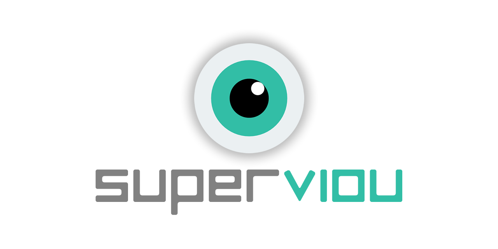

This is a cross-platform electron app (Windows & macOS) that takes a 4:3 aspect ratio video file, and transforms it to a 16:9 video using the  [GoPro SuperView](https://gopro.com/help/articles/question_answer/What-is-SuperView) method. This means that the image is not naively scaled, but a dynamic scaling is applied where the outer areas are stretched more while the center parts stay close to the original aspect rate.

This is not a 1-1 copy of the GoPro algorithm, but an attempt to reach similar quality of output using the open-source [FFmpeg](https://ffmpeg.org/) encoder.

* Credits for the awesome Go cli app [SuperView from Niek](https://github.com/Niek/superview)

* Credits for the idea go to *Banelle*, who wrote the [initial (Python) implementation](https://intofpv.com/t-using-free-command-line-sorcery-to-fake-superview).

Here is a quick animation showing the scaling, note how the text in the center stays the same:

And if you feel like it, send me a beer! It's always appreciated!

